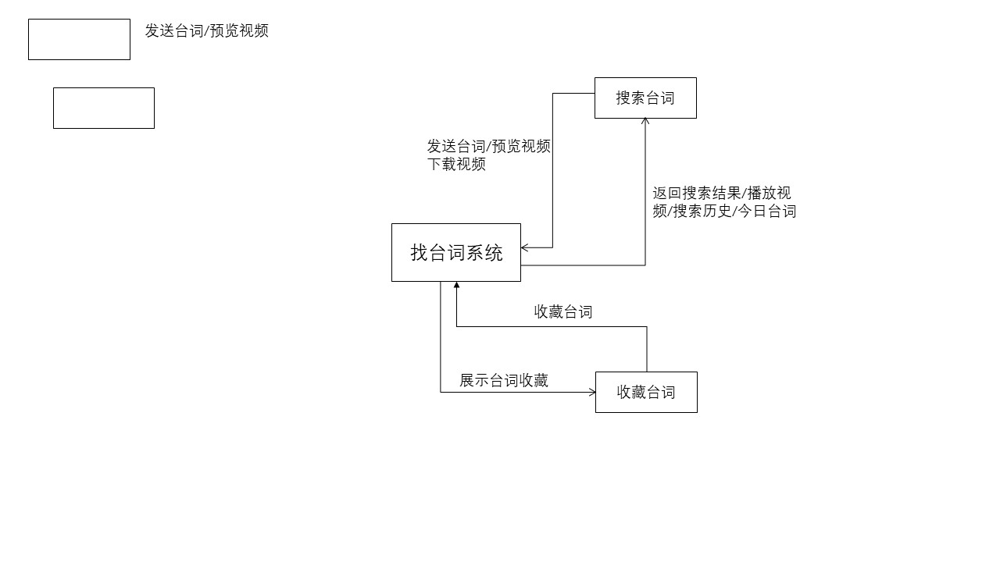

# ffmpeg-video
一些ffmpeg压缩视频脚本，还有一些关于根据单词找电影片段的想法



### 一些ffmpeg命令

```powershell
ffmpeg -i S01E02.mp4 -r 20 -s 960x540 -b:v 0.3M test.mp4

#改变为原视频的90%大小：
ffmpeg -i input.mpg -vf scale=iw*0.9:ih*0.9 output.mp4

#未压缩的视频 2.14Mb
ffmpeg -i S01\S01E01.mp4 -ss 0:00:43.73 -to 0:00:53.73 -c copy out2.mp4

#压缩后的视频 1.68Mb
ffmpeg -i S01\S01E01.mp4 -ss 0:00:43.73 -to 0:00:53.73 -r 20 -vf scale=iw*0.75:ih*0.75 out1.mp4

#码率压缩后的视频 600k
ffmpeg -i S01\S01E01.mp4 -ss 0:00:43.73 -to 0:00:53.73 -r 20 -vf scale=iw*0.75:ih*0.75 -b:v 400k output.mp4

#码率压缩后的视频 776k
ffmpeg -i S01\S01E01.mp4 -ss 0:00:43.73 -to 0:00:53.73 -r 20 -vf scale=iw*0.75:ih*0.75 -b:v 500k out2.mp4

#码率压缩后的视频 893k
ffmpeg -i S01\S01E01.mp4 -ss 0:00:43.73 -to 0:00:53.73 -r 20 -vf scale=iw*0.75:ih*0.75 -b:v 600k out3.mp4

#码率压缩后的视频 0.98Mb
ffmpeg -i S01\S01E01.mp4 -ss 0:00:43.73 -to 0:00:53.73 -r 20 -vf scale=iw*0.75:ih*0.75 -b:v 700k out4.mp4

#后台压缩命令
nohup /home/video/compress.sh > /home/video/compress_old_friend_S08-S10.log 2>&1 &

#剪切命令，但是会出现前面几秒黑屏的问题
./cut.sh compress/old_friend/Season01 output/old_friend/Season01 S01E02.mp4 0:03:33.31 0:03:48.48

#剪切命令，解决前面几秒黑屏的问题
#将-ss， -t 参数放在-i参数之前 剪切时间更加精确 如果编码格式采用的copy 最好加上 -avoid_negative_ts 1参数
${ffmpeg_path} -ss ${ss} -to ${to} -accurate_seek -i ${input_file} -c copy -avoid_negative_ts 1 ${output_file} -y


ffmpeg -i OHR.AgueroVillage_ZH-CN1007741117_1920x1080.jpg -q 20 -vf scale=-1:768 -y out.jpg
```


